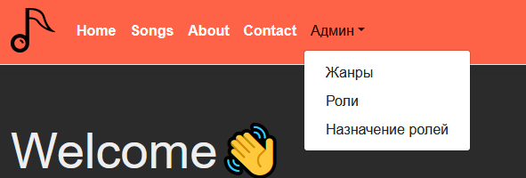

# MusicService ASP.Net Core MVC

____

### "Админ" - This tab is for various functions that should only be accessed by the Service Admin.
### "Жанры" - Tab for creating new genres.
### "Роли"  - Tab for creating new roles.
### "Назначение ролей" - A tab for adding a role to the user, for example, appoint the user as Admin.
